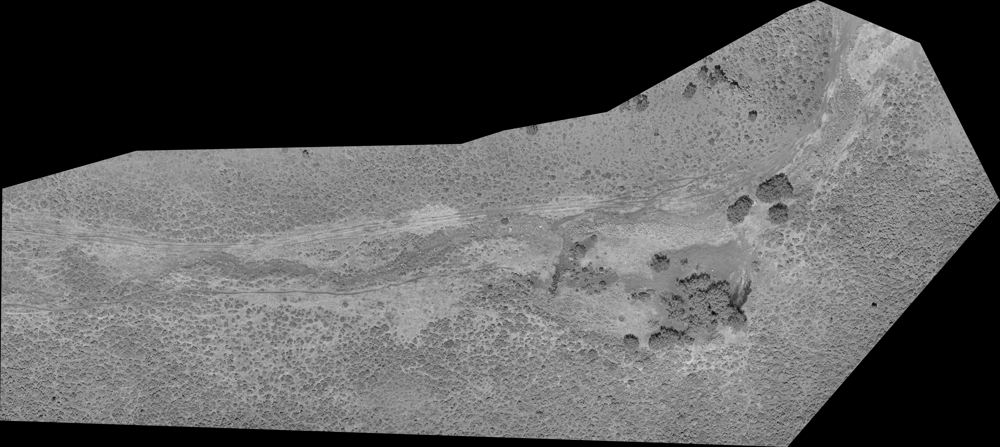
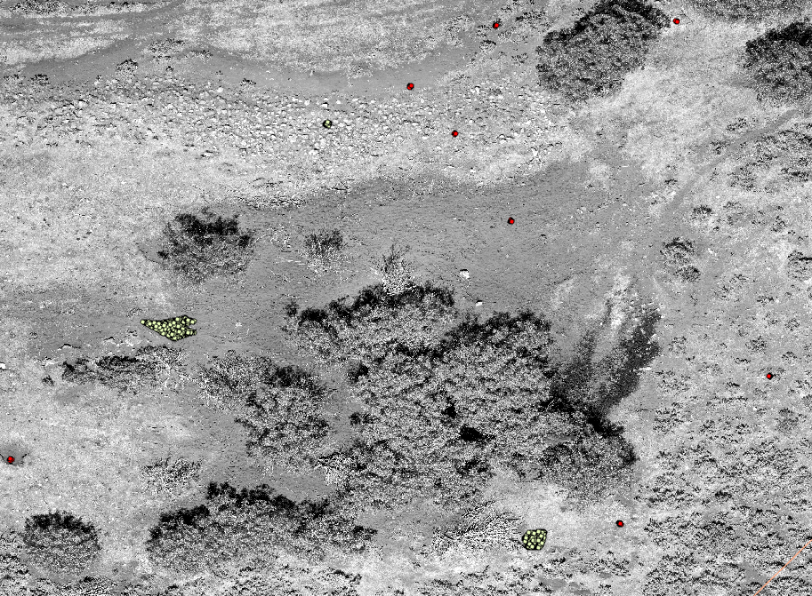
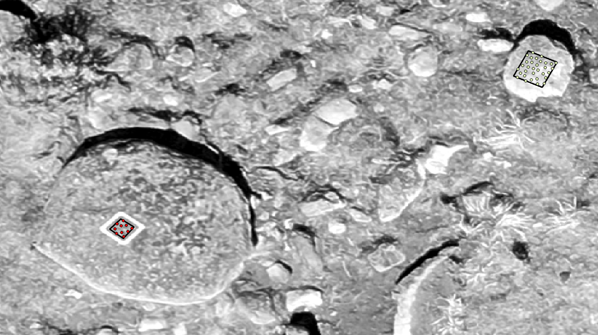

# uav-image-processing-classification

This repository contains example code flow to process and classify orthorectified UAV vegetation imagery 
to identify the proportional cover of functional plant groups within an area of interest. This process can be modified to identify the proportion of individual species as well.  

This requires processing orthomosaics, Digital Terrain Models (DTM), and 
Digital Surface Models (DSM) in 3rd party software, typically your flight
planning software, as input.GIS software such as Q (freeware) or ArcPro is also required to extract point based values.  

# Table of Contents

* [UAV phenology-based data aquisition and processing steps](https://github.com/mleedavis/uav-image-processing-classification#data-aquisition-and-processing-steps) 
* [Pre-processing imagery to obtain orthomosaics, DTM, and DSM rasters](https://github.com/mleedavis/uav-image-processing-classification#pre-processing-imagery-to-obtain-orthomosaics,-DTM,-and-DSM)
* [Texture analysis and canopy height model classification](https://github.com/mleedavis/uav-image-processing-classification/tree/main#texture-analysis-and-canopy-height-model-calculation)
* [Preparing Final Data for Classification]()
* [Image classification]()
* [Accuracy analysis]()

# Data aquisitions and processing steps

* Collect field data
  + Collect UAV imagery and field data including ground control points (GCPs) and vegetation data sample data at the species/functional group level of interest: see documents folder for more details and a basic overview of the data aquisition process
* Process imagery
  + Process photos and GCPs in 3rd party software to obtain orthomosaics, DTM and DSMs
* Texture Analysis and Canopy Height Model calculation (use process-imagery.R)
  + Process orthomosaic bands to obtain first-order-occurrence measures for textural analysis
  + Calculate vegetation height (CHM)
* Image classification process (QGIS or similar)
  +Prep raster data 
    - Clip orthomosaic raster to polygon to eliminate edge effects and no-data cells
    - Resample all rasters to the clipped baseline raster
    - Clip resampled rasters to the clipped baseline raster
  +Prep Training and Validation data
    - Training data: photo-interpret patches of pure vegetation, assign unique class codes, generate random sample points
    _ Validation data: assign unique class codes to GCPs, generate random sample points
    _ Join random sample points to their polygons/GCPs and then extract values for all input raster varibles to random sample points; there should be a column for all response and explanatory variables in the resulting attribute tables
* Random Forest Classification (classify-imagery.R)
  

# Pre-processing Imagery to Obtain Orthomosaics, DTM, and DSM
Pre-processing imagery to orthorectify imagery, produce final orthomosaics, incorporate ground control points, and produce digital terrain and digital surface models can be carried out in a variety of proprietary and open source software. An example image should look something like this green band which has been extracted from a final mosaic image covering a several hectare spring and intermittent stream restoration project site (for ease of display the green band is rendered with a black to white stretch here): 

# Texture Analysis and Canopy Height Model Calculation
This step utilizes the process-imagery.R script to generate additional variables for differentiating functional groups and plant species in the image classification step outlined below.

## Process orthomosaic bands to obtain first-order-occurrence measures for textural analysis
Texture analysis is used to generate additional predictor variables beyond red-blue-green values obtained from image pixels. Texture analysis will create new rasters by defining new pixel values based on neighboring rgb values; this process can be run for each band (the red,green, and/or blue bands) of the orthomosaics, however the example here utilizes only the green band. 

Neighborhoods with similar values (bare ground for instance, which is expected to be more uniform that shrubs or trees) will result in 'smoother' textures than neighborhoods with dissimilar values (shrubs, trees, or other 'rougher' surfaces that are expected to vary more in rgb values across short distances). This step can be very slow for larger extents  (modification to loop through parallel process on the to-do list). 

Neighborhood variance, entropy, and skewness are computed here. Neighborhood (window) size should be set based on the number of pixels that cover an object(s) of interest. In this example a neighborhood of 15 pixels was utilized.  

## Calculate vegetation height (CHM)
Vegetation height (or the Canopy Height Model) is also computed as a new raster in this step by subtracting the digital terrain model (DTM) from the digital surface model (DSM) obtained from step 1 above. 
  DTM-DSM = CHM

These models are typically computed via 'structure from motion' methods unless lidar is available. These methods rely on parallax in overlapping imagery, therefore vegetation that obscures the land surface may impact the utility of this step, however it typically performs well in non-forested areas. 

Values from the rasters that result from these steps, as well as the original rgb values from the orthomosaics are next extracted for use as training and validation data sets. 

# Preparing Final Data for Classification

## Preparing Raster Data 
In your GIS software of choice, clip the original orthomosaic layer to a polygon that defines your project area of interest.

Ideally this polygon is generated before data acquisition and is used in the flight planning process (collect data beyond the edges of this polygon). This step removes any edge pixels that contain no value data or parallax issues. 

Next, resample all raster layers to the clipped othomosaic keeping cell output the same as the original mosaic and utilizing cubic resampling (set as an option in your GIS of choice). Finally clip all remaining rasters resulting from previous steps to the original mosaic, being sure to maintain clipping extent. 

## Extracting point values (variables) for model input
This step relies on extracting point data from each of the rasters within defined polygons (established in this step) and quadrats (established during field work/imagery acquisition). Randomly generated points are generated within polygons and sample quadrats and then are spatially joined to each raster to extract values for training and validating models (please see documents folder for far more detailed instructions). 

### Extracting training data
Training data are extracted in post-processing by hand drawing small polygons around 'pure patches' of vegetation that fall within pre-defined functional groups or individual species. 

|:-:|
|*Randomly generated points (in a GIS) used to extract training (yellow) and validation (red) data from spatial joins to raster layers. The yellow points in the left center of this image were placed in a hand-drawn polygon that represented a pure patch of 'bare ground' for this example. See below for a detailed image of validation points.*|

### Extracting validation data
Validation data are extracted using the same method as training data, but randomly generated points are constrained to sample quadrats established during image capture. 

|:-:|
|*Validation points (red) generated within a 1/4x1/4 meter pvc sample frame placed during field collection and training points (yellow) from post-processing. Black polygons were hand-generated for each source in this example to extract data for 'Rock'.*|

# Image Classification with Random Forests
This step utilizes the classify-imagery.R script to generate additional variables for differentiating functional groups and plant species in the image classification step outlined below.
